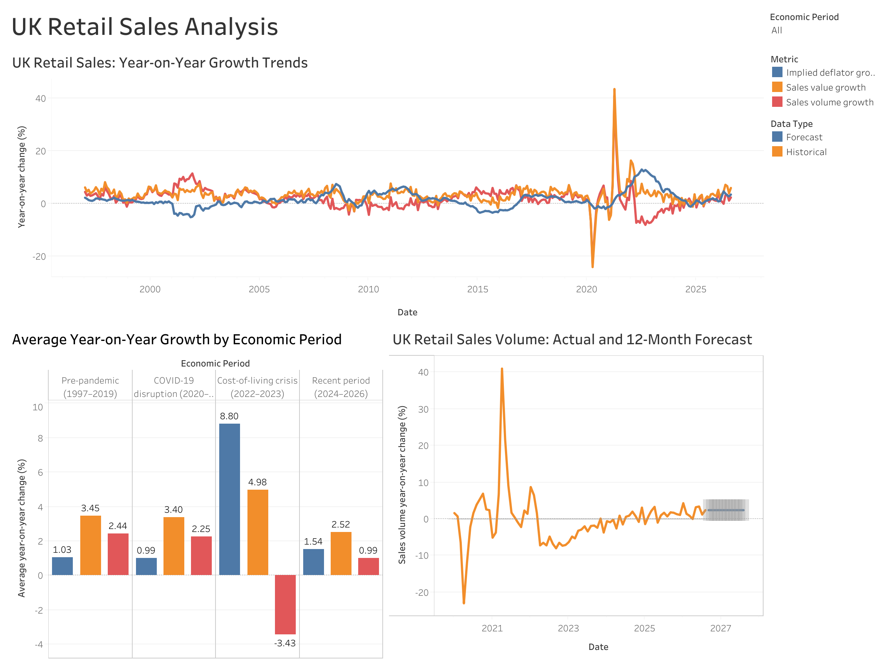

# UK Retail Sales Analysis

An end-to-end data analysis and forecasting project using official UK retail sales data from the Office for National Statistics (ONS).

The project uses Python for data preparation, exploratory analysis and time-series forecasting, followed by Tableau for dashboard development and communication of the findings.

## Project objectives

- Collect and validate official UK retail sales data.
- Analyse long-term movements in sales value, sales volume and retail prices.
- Compare performance across major economic periods.
- Evaluate forecasting models using an unseen test period.
- Produce a 12-month forecast of retail sales volume growth.
- Build an interactive Tableau dashboard for presenting the results.

## Data source

The project uses the ONS Retail Sales Index dataset:

- [ONS Retail Sales Index dataset](https://www.ons.gov.uk/businessindustryandtrade/retailindustry/datasets/retailsales)
- [Download the current ONS CSV file](https://www.ons.gov.uk/file?uri=/businessindustryandtrade/retailindustry/datasets/retailsales/current/drsi.csv)

The source file contains hundreds of retail sales series. Five monthly measures for all retail businesses, including automotive fuel, were selected for the core analysis.

## Core measures

- Sales value: year-on-year percentage change
- Sales value: month-on-month percentage change
- Sales volume: year-on-year percentage change
- Sales volume: month-on-month percentage change
- Implied deflator: year-on-year percentage change

The implied deflator represents the approximate change in retail prices by comparing sales value with sales volume.

## Key findings

- The cleaned monthly dataset contains 356 observations from January 1997 to August 2026.
- The time series is continuous, with no missing months or duplicated dates.
- During the pre-pandemic period, average annual sales-value growth was 3.45%, while sales-volume growth averaged 2.44%.
- During the 2022–2023 cost-of-living crisis, average sales-value growth increased to 4.98%, but sales-volume growth fell to -3.43%.
- The implied deflator averaged 8.80% during 2022–2023, indicating that higher retail spending was largely driven by price growth rather than greater purchasing volumes.
- The largest month-on-month disruption occurred during the COVID-19 pandemic: sales volume fell by 17.8% in April 2020 and rebounded by 13.2% in May 2020.
- Implied-deflator growth reached its highest level of 13.0% in July 2022.

## Forecasting approach

A 24-month holdout period was used to compare three forecasting approaches:

| Model | MAE | RMSE |
|---|---:|---:|
| Naïve benchmark | 1.17 | 1.50 |
| Exponential smoothing | 1.18 | 1.52 |
| SARIMA | 1.30 | 2.01 |

The naïve benchmark produced the lowest MAE and RMSE and was therefore selected for the final forecast.

The final forecast projects annual retail sales-volume growth of approximately 2.4% from September 2026 to August 2027. The 95% prediction interval ranges from approximately -0.5% to 5.3%, showing that the future path remains uncertain.

### Dashboard preview



## Tableau dashboard

The Tableau dashboard contains:

- A long-term comparison of sales-value growth, sales-volume growth and the implied deflator.
- Average growth rates across four economic periods.
- Historical and forecast sales-volume growth with a 95% prediction interval.
- An interactive economic-period filter.

Workbook:

```text
tableau/uk_retail_sales_dashboard.twb

```

The supporting Tableau CSV files are stored in the same folder.

## Project structure

```text
uk-retail-sales-analysis/
├── data/
│   ├── raw/
│   ├── interim/
│   └── processed/
├── notebooks/
│   ├── 01_ons_retail_sales_data_audit.ipynb
│   ├── 02_exploratory_retail_sales_analysis.ipynb
│   ├── 03_retail_sales_time_series_forecasting.ipynb
│   └── 04_tableau_data_preparation.ipynb
├── reports/
│   └── figures/
├── tableau/
│   ├── retail_sales_actual_forecast.csv
│   ├── retail_sales_historical_long.csv
│   ├── retail_sales_historical_wide.csv
│   └── uk_retail_sales_dashboard.twb
├── .gitignore
├── README.md
└── requirements.txt
```

## Notebook workflow

1. **Data audit**  
   Inspect the ONS structure, identify monthly series, validate coverage and create the core monthly dataset.

2. **Exploratory analysis**  
   Examine trends, volatility, correlations, exceptional months and differences between economic periods.

3. **Time-series forecasting**  
   Test stationarity, create a train-test split, compare forecasting models and export the selected 12-month forecast.

4. **Tableau preparation**  
   Create validated wide, long and actual-versus-forecast datasets for dashboard development.

## Tools and techniques

- Python
- pandas and NumPy
- Matplotlib and Seaborn
- statsmodels
- scikit-learn
- JupyterLab
- Tableau
- Git and GitHub
- Time-series decomposition
- Augmented Dickey-Fuller stationarity testing
- Exponential smoothing
- SARIMA
- Holdout validation
- MAE, RMSE and AIC model evaluation

## Running the project

Install the required Python packages:

```bash
python -m pip install -r requirements.txt
```

Start JupyterLab:

```bash
jupyter lab
```

Run the notebooks in numerical order.

## Limitations

- The final naïve forecast assumes that the latest annual growth rate continues throughout the forecast period.
- The forecast models use historical sales-volume growth only and do not include external economic predictors.
- Structural shocks such as pandemics, policy changes or renewed inflation may cause future performance to differ materially from the forecast.
- The analysis focuses on percentage growth rather than forecasting the underlying Retail Sales Index level.

## Status

Analysis, forecasting and Tableau dashboard completed.
